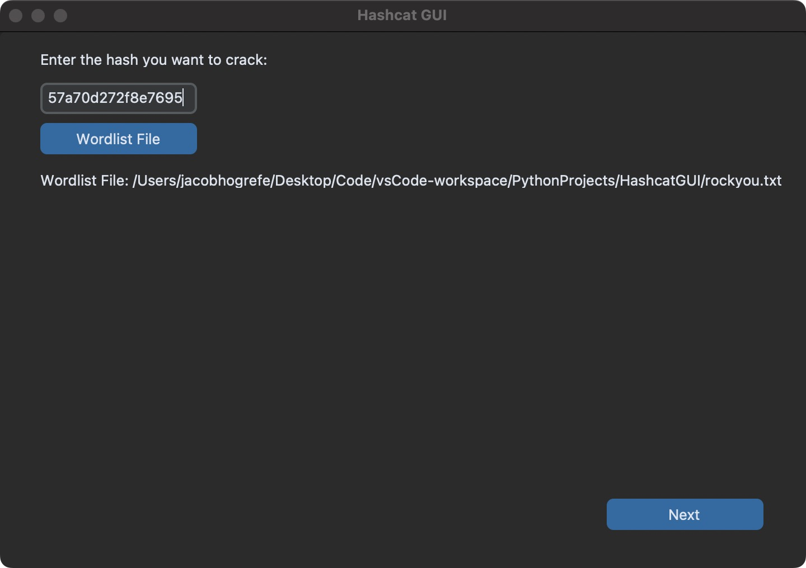
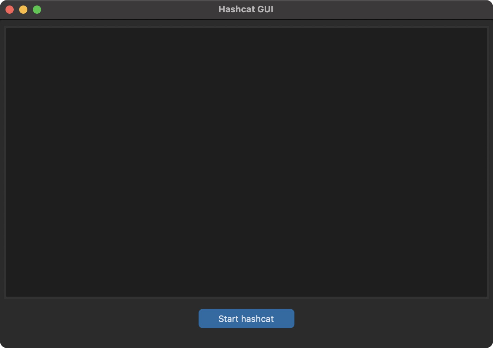
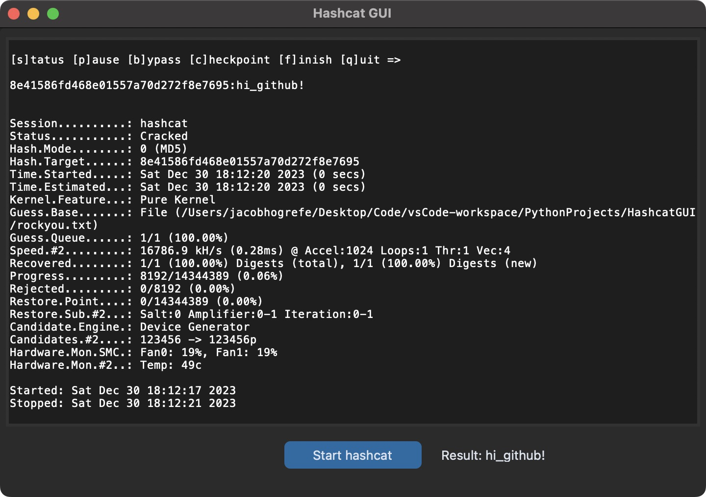

# HashcatGUI

A simple GUI for hashcat.

## What is this?

This is a GUI made for the command line program hashcat. This application is not designed to take full advantage of the hashcat program, it's purely for cracking hashes in as simple manner as possible. Instead of having the user find the type of hash used, I implemented the use of [name-that-hash](https://github.com/HashPals/Name-That-Hash/tree/main?tab=readme-ov-file) to identify the type of hash used, and get the corresponding hashcat mode for it.

*Note: as hashcat is primarily used on Unix based operating systems, Linux and Mac, I haven't been able to implement Windows support, although that can change in the future.

## Why did I make this?

When I was using hashcat for one of my Cybersecurity labs, I felt that the command line arguments didn't make much sense when I was attempting to crack hashes for that lab. So, I turned to my knowledge of Python in order to make a GUI for hashcat, to make using the application as easy as possible. The end result is a clean but functional UI that makes cracking hashes as seamless as possible. Overall, I'm very happy with how this came out, and I learned a lot more about Python and hashcat as a result.

## Screenshots

Start screen of the application

What the app looks like before the hash starts being cracked

What the app looks like after the hash has been cracked

## Requirements

As hashcat doesn't come preinstalled, here are instructions to install it.

### Mac and Linux
Run the following commands in the terminal:

`sudo apt update`

`sudo apt upgrade`

`sudo apt install hashcat`

## Setup

This project works best in a virtual environment, and these instructions will guide you on getting a virtual environment up and running. In the directory of the project, run the following commands to get everything set up.

Create the virtual environment:
`python3.8 -m venv env`

Activate the virtual environment:
`source env/bin/activate`

Install the necessary versions of the required packages:
`pip install -r requirements.txt`

## How to Run

Just run the following command in the directory of the project:
`python3 HashcatGUI.py`

## Additional Feature Ideas

* Supporting more hash cracking methods
* Implement more of the hashcat CLI program into the HashcatWrapper file
* Functionality on Windows devices
* Add more advanced functionality for more customization
* Make the UI look nicer
* Add the ability to display already cracked hashes (hashcat requires the --show parameter)

## Additional Resources
It's good to have an up-to-date wordlist to crack hashes from. This one I found online should do the trick.

[Rock You Wordlist](https://github.com/brannondorsey/naive-hashcat/releases/download/data/rockyou.txt)